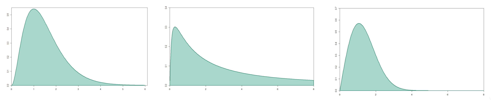
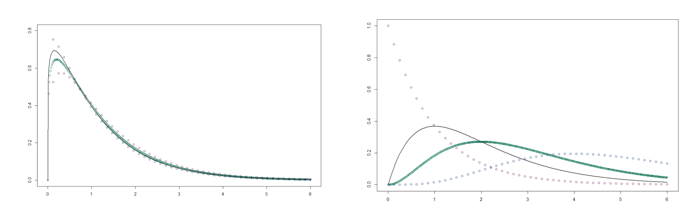
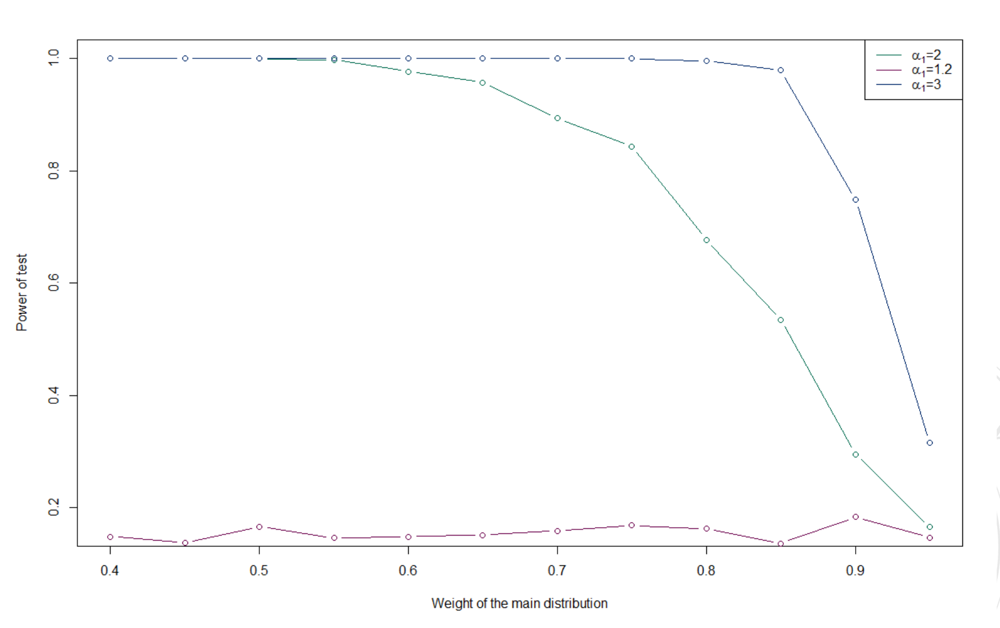

# Chi-Square Test Performance Analysis on Distribution Identification

## Overview

This project evaluates the performance of the Chi-square goodness of fit test in distinguishing different statistical distributions. The primary focus is on assessing the test's ability to differentiate Weibull and Log-normal distributions from Gamma distributions, as well as its effectiveness in identifying mixtures of Gamma distributions.

## Hypothesis

Our initial hypothesis posited that the Chi-square test would effectively distinguish Weibull and Log-normal distributions from Gamma distributions but would struggle to correctly identify mixtures of Gamma distributions, especially when the distributions' parameters are similar or when the mixture is dominated by one distribution.

## Methodology

We simulated data from pure Gamma, Weibull, and Log-normal distributions, as well as from mixtures of Gamma distributions with varying weights and parameters. We then applied the Chi-square test to each dataset to assess whether the test could correctly identify the distribution type.

*Figure 1: Gamma, Log-Normal and Weibull Distributions.*

*Figure 2: Mixture of Gamma Distributions.*

### Distributions Tested

- **Gamma Distribution**
- **Weibull Distribution**
- **Log-normal Distribution**
- **Mixture of Gamma Distributions**

Each type was evaluated under varying parameters to thoroughly assess the Chi-square test's robustness.

## Results

Our findings confirm the initial hypothesis:
- The Chi-square test accurately identified Weibull and Log-normal distributions as distinct from Gamma distributions.

| Distribution  | Tested As Gamma | Tested As Not Gamma |
|---------------|-----------------|---------------------|
| **Gamma**     | 963             | 37                  |
| **Weibull**   | 35              | 965                 |
| **Log-normal**| 0               | 1000                |

- The test faced challenges with mixtures of Gamma distributions, particularly when one distribution heavily outweighed others or when the distributions' parameters were close to each other.

### Detailed Findings

- **Majority-Distribution Weight**: The larger the weight of the majority distribution in the mixture, the harder it was for the Chi-square test to distinguish the mixture from a pure Gamma distribution.

| Weights          | α parameters (α1 = 1.2, α2 = 1.1, α3 = 1.3) | α parameters (α1 = 2, α2 = 1, α3 = 3) | α parameters (α1 = 3, α2 = 1, α3 = 5) |
|------------------|---------------------------------------------|---------------------------------------|---------------------------------------|
| w1 = 0.40, w2 = 0.03, w3 = 0.30 | 0.148 | 1     | 1     |
| w1 = 0.45, w2 = 0.25, w3 = 0.30 | 0.137 | 1     | 1     |
| w1 = 0.50, w2 = 0.25, w3 = 0.25 | 0.166 | 1     | 1     |
| w1 = 0.55, w2 = 0.20, w3 = 0.25 | 0.146 | 0.998 | 1     |
| w1 = 0.60, w2 = 0.20, w3 = 0.20 | 0.148 | 0.977 | 1     |
| w1 = 0.65, w2 = 0.15, w3 = 0.20 | 0.151 | 0.958 | 1     |
| w1 = 0.70, w2 = 0.15, w3 = 0.15 | 0.158 | 0.894 | 1     |
| w1 = 0.75, w2 = 0.10, w3 = 0.15 | 0.168 | 0.844 | 1     |
| w1 = 0.80, w2 = 0.10, w3 = 0.10 | 0.162 | 0.677 | 0.996 |
| w1 = 0.85, w2 = 0.05, w3 = 0.10 | 0.136 | 0.535 | 0.979 |
| w1 = 0.90, w2 = 0.05, w3 = 0.05 | 0.183 | 0.295 | 0.749 |
| w1 = 0.95, w2 = 0.025, w3 = 0.025| 0.146 | 0.165 | 0.315 |

- **Parameter Proximity**: The closeness of the Gamma parameters in the mixture also significantly affected the test's ability to accurately identify the distribution type.

*Figure 3: Power of test plotted against the weight of the majority-distribution in a mixture.*

## Conclusion

The Chi-square test is reliable for identifying distinct left-skewed distributions like Weibull and Log-normal from Gamma distributions. However, its performance diminishes when dealing with mixtures of Gamma distributions, especially under conditions of parameter similarity and dominant weight. These insights can guide statisticians in choosing appropriate methods for distribution identification in practical applications.

