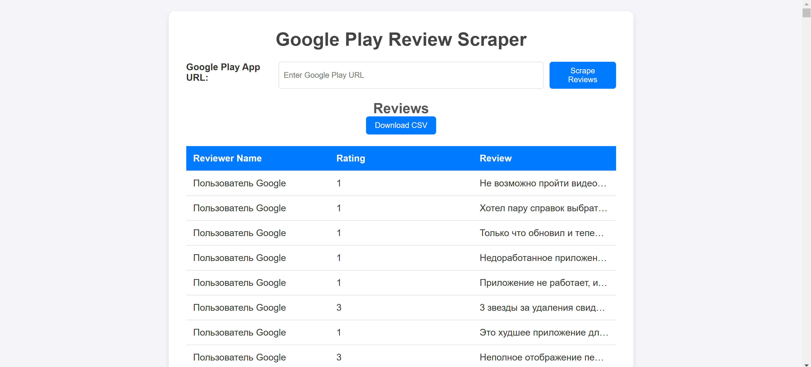

# Google Play Review Scraper

## Description

This project is a web-based application built with Flask that allows users to scrape reviews from any Google Play app and display them on a webpage. The application supports input via a Google Play URL and provides the option to download the scraped reviews as a CSV file.

## Features

- **Scrape Reviews**: Extracts user reviews for any Google Play app based on its URL.
- **Display Reviews**: Shows the scraped reviews in a user-friendly table format.
- **Download as CSV**: Allows users to download the reviews in CSV format for further analysis.

